# Banking System (Console)

Name: Viktoriya Zalesskaya  
Group: (your group)

## Brief Description
This project is a simple console-based banking system. It allows users to create accounts, perform basic financial operations, and manage requests.

The main goal was to practice working with data structures such as LinkedList, Stack, Queue, and arrays.

## Project Idea
The system simulates basic banking functionality with different roles:

- Bank: account management
- ATM: deposit and withdrawal operations
- Admin: handling account requests

## Implemented Features

### Task 1: BankAccount Class
Created a class with the following fields:
- account number
- username
- balance

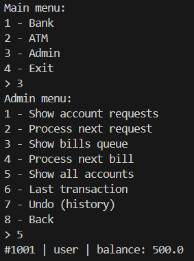

### Task 2: LinkedList
Used to store all accounts:
- add account
- display accounts
- search account by number

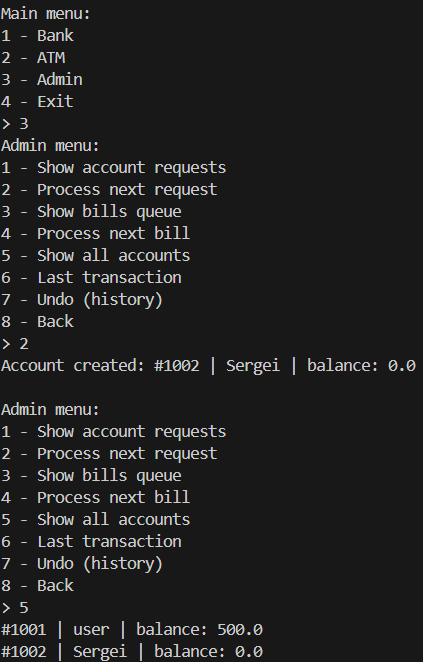

### Task 3: Deposit and Withdraw
Implemented basic operations:
- deposit money
- withdraw money with balance check

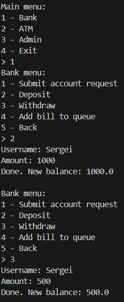
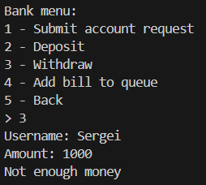

### Task 4: Stack (Transaction History)
Used Stack to store transaction history:
- push transaction
- view last transaction (peek)
- remove last transaction (pop)

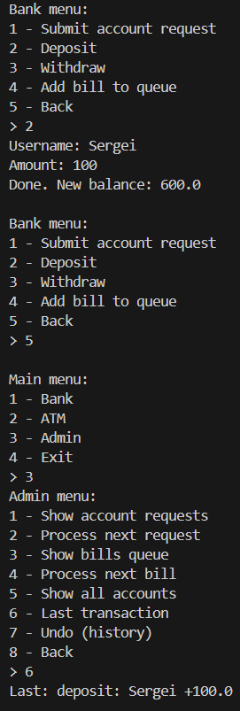
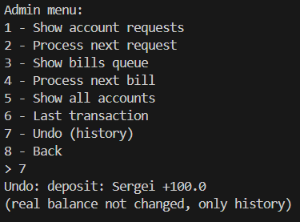

### Task 5: Queue (Bill Payments)
Queue is used for bill payments:
- add bill to queue
- display queue
- process next bill

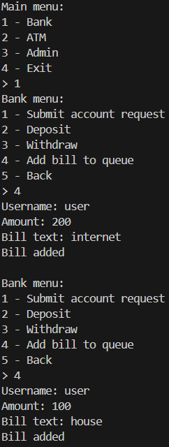
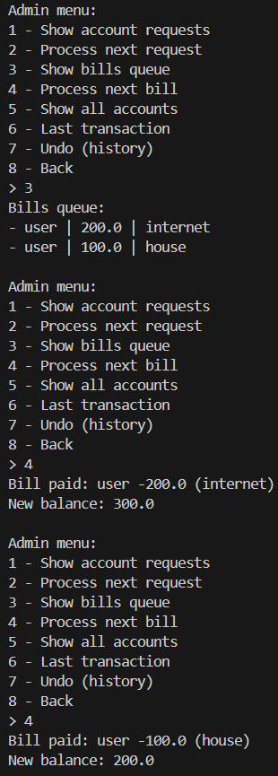

### Task 6: Queue (Account Requests)
Queue is also used for account requests:
- submit request
- admin processes requests

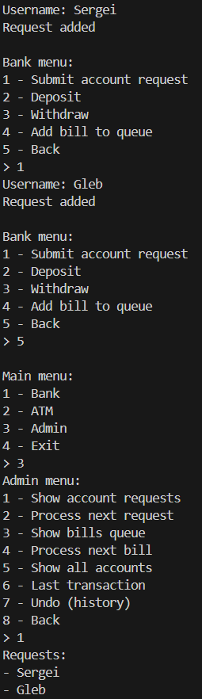
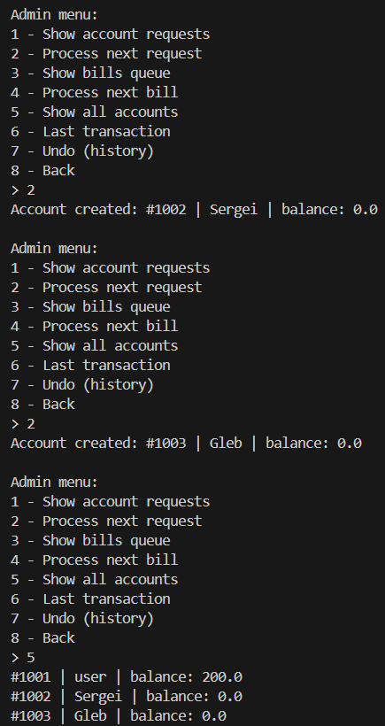

### Task 7: Array
Created an array of 3 BankAccount objects and displayed them.

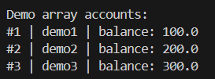

### Task 8: Main Menu
Implemented a simple menu system:
- Bank
- ATM
- Admin

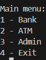
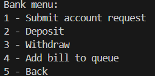
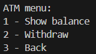
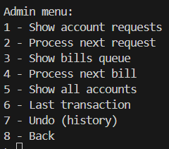

## Conclusion
This project helped me understand how different data structures work in practice. It was a good experience building a simple interactive console application.

